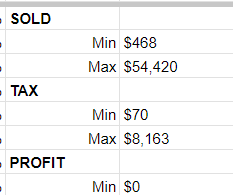
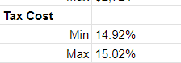

## About the Game


The setting of this Case Study is in the game LifeAfter. LifeAfter is a survival MMORPG developed by NetEase.[Source](https://en.wikipedia.org/wiki/LifeAfter). The setting is a post-apocalyptic world where players join together for surival.

LifeAfter features a marketplace where each player could sell their resources at a certail price. Other than this, the game also has a "profession" feature. As the name suggests, the players can choose their "profession" and they will be granted exclusive skills. These professions are generally categorized into 3:

  * Combat Cert- Grants skills that focuses on enhancing the player's damage.
  * Gather Cert- Grants skills that will allow the player to extract exclusive raw materials.
  * Craft Cert - Grants skills that will allow the player to craft exclusive products to sell.
  
The focus of this Case Study is a player that has a Craft Cert, specifically a firearms maker profession. The players sells three things at the market:

  * Steel Pipes
  * Engineering Plastic
  * Medium-Carbon Steel

Data about the player's sales and expenses have been recorded from November 2024 to December  2024.

_Note: The terms "profit" or "sales" might have been used incorrectly throughout the study. I had to build the database and I am not well-versed at the difference of these terms. I am referring to the total amount of money generated after tax is subtracted in this scenario._

## Business Task

In this pretend scenario, the player would like to know the following 

  * Which product is more profitable?
  * Which skill to upgrade?
  * What price should each product be sold for?
  
## Setting up my Environment

Installing packages

```{r Packages}
install.packages ("tidyverse")
library(tidyverse)
install.packages("readxl")
library(readxl)
```
The Dataset for this scenario has been compiled at Google Sheets. It has been cleaned there by checking duplicates, ensuring correct data type, checking for Min and Max values, distinct values, as well as trimmed white spaces. Unnecessary columns and sheets have been dropped as well and everything is converted to CSV files. The necessary tables are as follows:

```{r Tables}
profit <- read_excel("Personal Case Study.xlsx", sheet = "Profit Log")
expenses <- read_excel("Personal Case Study.xlsx", sheet = "Expenses Log")
```

## Data Cleaning
Most of the Data Cleaning has been done in Google Sheets.

First is cleaning the "Profit Log" sheet.


_Note: Dollars has been set as currency for this scenario. The currency in game is "Gold Bars" (GBs)._


At first glance, we can see that the items have been set into chips in order to prevent incorrect entry. So, the rest of the columns are just trimmed of their white spaces with "=trim()". Furthermore, their formats have been set manually.


Next, the min and max values of each column has been checked.




Here, we can see that there is a min profit of $0. Upon scrolling down, I found out that there are empty cells waiting to be filled.


These rows have been deleted and the checking for the min and max values proceeded until the end. 


Curiously, the minimum tax percentage is 14.92% which is far from the usual range 14.98% to 15.02%.


Through a filter, this has been checked. It turned out to be a single item.


There is likely a mistake in the data entry of how much was deducted for the tax. So, it was recalculated. The tax should have been "$4,896". It was indeed an error in the data.

However, the 2 minimum values still remains at 14.95% and 14.96%. 


Upon checking, it appears that these items were bought in small quantities which contributed to the calculation.


I've decided to keep them as I don't want to over manipulate the data. 

Meanwhile, the maximum value of tax percentage sits at 15.11% which is also unnatural. Upon checking. It appears to be a single batch. 


It's likely another data entry error. 

Instead of recalculating the tax, it was the cost at which it was sold that was recalculated because the Unit Cost doesn't look possible. In the game, the player is given options on how much to sell this particular product; they cannot sell it at their own price.

Upon Checking, it does appear to be an error. These products cannot be sold at $466 but instead at $468.


The price at which it was sold was adjusted accordingly to "$4,680" and the tax has been adjusted accordingly to "$702". This puts the min and max values in a reasonable range.



The" %Tax" and the "Tax" Columns are unnecessary for the upcoming analysis and so they were deleted from the table. Finally, this sheet has been exported as a csv file.

Next, the "Expenses Log" sheet is up for cleaning.


The items are in a dropdown box as well as what they are bought for in order to prevent error in data entry. Nevertheless, the rules has been checked in order to ensure that there is no white spaces before and after the options. The date has been formatted to a date format and the cost values have been trimmed.

Next, there seemed to be spending on Miscellaneous things which are all needed for the production of these products but does not directly contribute to the making of them. For example, the Auto Miner are used to mine the raw materials needed to produce all three products and the Steel Pipes that were bought are likely to fix the price of these items in the market. Thus, these miscellaneous spending are deleted from the table because the analysis will only focus on the profitability of each product. The quantity column has been dropped as well.

Then, the rows were checked and just like in the profit log, there are cells that are still waiting to be filled.


These are deleted from the table and the sheet was exported as csv.

## Data Analysis

We first try to see what we're dealing with as well as to check the data type in each column.

```{r Data Exploration}
head (profit)
head(expenses)
head(monthly)
```

The data types seems to be correct.So, I move on to answering the business tasks.

Firstly is to identify which of the three products is most profitable. In order to do this, we have to find the total profit in each product.

```{r Total Profit of each product}
profit_sum <- profit %>%
  group_by(ITEM) %>%
  summarize(sum_value = sum(PROFIT))
print(profit_sum)
```
From this, we know that the Engineering Plastics sells well followed by the Medium-Carbon Steel by only 60,000 unit. The difference is close compared to how much the Steel Pipes sold.

We can delve deeper and figure out what made this possible.

```{r Total Items sold per Product}
profit %>%
  group_by(ITEM) %>% 
  summarize (sum_value = sum(QTY))
```
Apparently, the Engineering Plastics are selling more even if they have lower UNIT COST than the Medium-carbon Steel. 

Next, I figure out at what price should each product be sold.

I start with the Engineering Plastic.

```{r Recommended Price: Engineering Plastic}
profit %>% 
  group_by(`UNIT COST`) %>%
  filter(ITEM == "Engineering Plastic") %>% 
  summarize (sum_value = sum(QTY)) %>% 
  arrange(desc(sum_value))
```

The data above shows that more than half of the Engineering Plastics are sold at a price of $2008. 

Next, the Medium-carbon Steel.

```{r Recommended Price: Medium-Carbon Steel}
profit %>% 
  group_by(`UNIT COST`) %>%
  filter(ITEM == "Medium-carbon Steel") %>% 
  summarize (sum_value = sum(QTY)) %>% 
  arrange(desc(sum_value))
```
The Data above shows that most of the Medium-carbon steel are sold at a price of $2,176. 

Finally, I check the Steel Pipes.

```{r Recommended Price: Steel Pipe}
profit %>% 
  group_by(`UNIT COST`) %>%
  filter(ITEM == "Steel Pipe") %>% 
  summarize (sum_value = sum(QTY)) %>% 
  arrange(desc(sum_value))
```
The Data above shows that most of the Steel Pipes are sold at a price of $535.

## Data Visualization

The graph below shows the difference in profit of the three products.

```{r Most Profitable}
ggplot(data=profit)+
  geom_col(mapping = aes(x=ITEM, y=PROFIT,fill=ITEM))+
  scale_fill_manual(values = c("Engineering Plastic" = "Green", "Medium-carbon Steel" = "#7d7170", "Steel Pipe" = "Gray" )) +
  geom_text(data=profit_sum, aes(x=ITEM, y=sum_value, label = sum_value))+
  labs (title = "Most Profitable Products", x = "Products", y = "Profit ($)")
```


This column chart shows the difference in profit between the three products. It's clear that Steel Pipes doesn't sell as much as the other two and that Engineering Plastics were able to generate more profit despite having lower Unit Cost. This shows that Engineering Plastics must be in demand in the market.

I'd like to show as well these data in comparison with their respective expenses.

```{r Most Profitable w/ Expenses}
expenses_sum <- expenses %>%
  group_by(FOR) %>%
  summarize(total_expenses = sum(COST))

ggplot(data=profit)+
  geom_col(mapping = aes(x=ITEM, y=PROFIT,fill=ITEM))+
  scale_fill_manual(values = c("Engineering Plastic" = "Green", "Medium-carbon Steel" = "#7d7170", "Steel Pipe" = "Gray")) +
  geom_text(data=profit_sum, aes(x=ITEM, y=sum_value, label = sum_value), vjust = 0) +
  geom_col(data = expenses, mapping = aes(x = FOR, y=COST), fill = "red", alpha = .75)+
  geom_text(data=expenses_sum, aes(x=FOR, y=total_expenses, label = total_expenses), vjust = 0)+
  labs (title = "Most Profitable Products", subtitle = "with respective expenses", x = "Products", y = "Profit ($)")
```

As we can see, Engineering Plastics costs less already and generates more profit. Meanwhile, Medium-carbon Steel costs more to make but still couldn't make as much as Engineering Plastics do. Thus, Engineering Plastics remains as the top choice for mass production.

However, there is one more thing to note.
```{r Trend over two months}
filtered_ep <- profit %>% 
  filter(ITEM == "Engineering Plastic") 
filtered_mcs <- profit %>% 
  filter(ITEM == "Medium-carbon Steel")
filtered_sp <- profit %>% 
  filter(ITEM == "Steel Pipe") 

ggplot () +
geom_smooth(data = filtered_ep, aes(x = DATE, y = PROFIT), color = "green")+
geom_smooth(data = filtered_mcs, aes(x = DATE, y = PROFIT), color = "#7d7170")+
geom_smooth(data = filtered_sp, aes(x = DATE, y = PROFIT), color = "gray")+
  labs (title = "Most Profitable Products Trend Line")
```

This graph shows the decline of Engineering Plastics towards the end of the year which is something to watch out for.

## Conclusion and Recommendation

With the data presented above, here are the answers to the business tasks:

  * The most profitable product based on ranking are as follows: Engineering Plastic, followed by Medium-carbon steel, and then Steel Pipes.
  * Skills that are recommended to be enhanced are those that produces Engineering Plastics and Medium-Carbon Steel.
  * The recommended prices of these 3 products are as follows:
  * Engineering Plastics - $2008
  * Medium-carbon Steel - $2176
  * Steel Pipes - $535

In addition, I would also like to recommend to prioritize upgrading the skills that can produce *Medium-Carbon Steel* than those that makes Engineering Plastics. There has been a decline in the sales of Engineering Plastics towards the end of the year. Additional studies needs to be done in order to figure out the cause. For now, i believe it is wise to hold back the supplies for Engineering Plastics untilt here is a steady increase in demand once again.

Given the steady profit from the top two products, i believe the Player is also ready to start unlocking skills that will allow them to craft other exclusive products.

Future data exploration and analysis may also involve diving into the costs of the raw materials in the market. The prices of the raw materials that are needed to produce these exclusives fluctuates in the market. It will be helpful to find the suitable price range at which the player could afford to buy the raw materials while maintaining a steady growth or retention on the overall profit.

_-Nothing Follows-_

## *Thank you.*